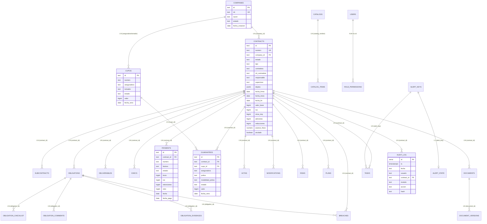

# Arquitectura de Base de Datos y Rendimiento (PostgreSQL 16)
**Sistema:** Nexo · Gestor Integral de Contratos  
**Motor:** PostgreSQL 16 (TypeORM 0.3 en NestJS 11)  
**Fecha:** Octubre 2026  

---

## 1. Diagrama Entidad-Relación (ERD Mermaid)



---

## 2. Estado de Normalización del Modelo Relacional

El modelo relacional se encuentra en **Tercera Forma Normal (3NF)** y en su mayoría en **Forma Normal de Boyce-Codd (BCNF)**:

1. **Primera Forma Normal (1NF):**
   - Todas las tablas poseen una clave primaria explícita (`id` con prefijo de dominio, ej. `CT-`, `EMP-`, `GR-`, `OB-`, o enteros autoincrementales controlados como `audit_log.id`).
   - Los atributos son atómicos (salvo la excepción técnica controlada de `contracts.deptos` en formato `jsonb` nativo para indexación GIN).
   - Ausencia de grupos repetitivos.

2. **Segunda Forma Normal (2NF):**
   - No existen dependencias funcionales parciales respecto a claves primarias compuestas (las tablas hijas poseen claves primarias simples o sustitutas independientes).

3. **Tercera Forma Normal (3NF):**
   - No existen dependencias transitivas entre atributos no clave en el esquema transaccional puro.
   - Los datos de la empresa matriz residen en `companies`; los contratos referencian `company_id`.
   - Las pólizas referencian contratos y cupos mediante claves foráneas con restricciones de integridad (`ON DELETE RESTRICT` para salvaguardar historial contractual y `ON DELETE CASCADE` para componentes dependientes como versiones de documentos, checklist y comentarios).

4. **Inmutabilidad y Auditoría en Base de Datos:**
   - La tabla `audit_log` implementa seguridad a nivel de motor mediante el trigger `trg_audit_log_insert_only` asociado a la función `audit_log_bloquear_cambios()`, impidiendo cualquier sentencia `UPDATE` o `DELETE` sin importar el rol de conexión.

---

## 3. Decisiones de Desnormalización Estratégica

Para garantizar tiempos de respuesta sub-10ms en operaciones de lectura concurrentes, se adoptaron las siguientes decisiones de desnormalización:

1. **Desglose Financiero en la Cabecera del Contrato (`contracts`):**
   - **Campos:** `valor_base`, `iva`, `otros_imp`, `adiciones`, `reducciones`.
   - **Razón:** Permite computar el `valor_actual = (valor_base + iva + otros_imp + adiciones - reducciones)` directamente en memoria y en proyecciones SQL sin requerir un join agregativo continuo contra la tabla `modifications`.
2. **Snapshot de Avance Físico (`contracts.avance_fisico`):**
   - **Razón:** Facilita ordenamientos y filtrados directos en el listado de contratos sin escanear la tabla `deliverables` o `execs`.
3. **Cobertura Geográfica Multidepartamental en `jsonb` (`contracts.deptos`):**
   - **Razón:** Evita la sobrecarga de una tabla puente relacional N:M para los 32 departamentos y distrito capital en operaciones OLTP rápidas. Se optimiza con un índice `GIN` especializado en PostgreSQL.
4. **Desnormalización Analítica Vía Vistas Materializadas:**
   - Para no degradar el modelo transaccional OLTP, las agregaciones pesadas (cálculo de semáforos, consolidación de pólizas, agregados geográficos nacionales y métricas de dashboard) se delegan a **Vistas Materializadas con refresco concurrente**.

---

## 4. Catálogo de Índices de Rendimiento Nuevos

Migración: `src/database/migrations/1727910000000-PerformanceIndexesAndMaterializedViews.ts`

| Tabla | Nombre del Índice | Columnas | Tipo | Consulta / Flujo que Sirve | Justificación Técnica |
|---|---|---|---|---|---|
| `contracts` | `ix_contracts_anulado_estado_company` | `(anulado, estado, company_id)` | B-Tree | `ContractsService.listar` | Filtro principal de contratos activos por empresa; evita Seq Scan en listas. |
| `contracts` | `ix_contracts_deptos_gin` | `(deptos)` | GIN | `GeoService` / Filtros mapa | Acelera búsquedas de pertenencia JSONB (`deptos @> '["08"]'::jsonb`). |
| `contracts` | `ix_contracts_fecha_firma` | `(fecha_firma)` | B-Tree | `ReportsService.rAnio` | Agrupación y filtros por año de firma sin escanear toda la tabla. |
| `contracts` | `ix_contracts_fecha_inicio` | `(fecha_inicio)` | B-Tree | `metrics.engine.ts` | Filtrado y cálculos de duraciones contractuales. |
| `contracts` | `ix_contracts_contratista` | `(contratista)` | B-Tree | Búsqueda y `r_cont` | Filtros por razón social de contratistas. |
| `contracts` | `ix_contracts_supervisor` | `(supervisor)` | B-Tree | `ContractsService.listar` / `r_sup` | Filtro por supervisor asignado. |
| `contracts` | `ix_contracts_responsable` | `(responsable)` | B-Tree | `ContractsService.listar` / `r_resp` | Filtro por responsable interno. |
| `subcontracts` | `ix_subcontracts_contract_created` | `(contract_id, created_at DESC)` | B-Tree | `ChildCollectionsService.listar` | Paginación de subcontratos por contrato sin ordenamiento en disco. |
| `obligations` | `ix_obligations_contract_created` | `(contract_id, created_at DESC)` | B-Tree | `ChildCollectionsService.listar` | Paginación de obligaciones por contrato ordenada por recencia. |
| `deliverables` | `ix_deliverables_contract_created` | `(contract_id, created_at DESC)` | B-Tree | `ChildCollectionsService.listar` | Paginación y timeline de entregables del contrato. |
| `execs` | `ix_execs_contract_created` | `(contract_id, created_at DESC)` | B-Tree | `ChildCollectionsService.listar` | Consulta de periodos de ejecución ordenados. |
| `payments` | `ix_payments_contract_created` | `(contract_id, created_at DESC)` | B-Tree | `ChildCollectionsService.listar` | Paginación de pagos de contrato ordenados cronológicamente. |
| `payments` | `ix_payments_estado_fecha` | `(estado, fecha)` | B-Tree | `ReportsService.rPagos` / Métricas | Agregación de pagos ejecutados (`estado = 'Pagado'`) por rango de fechas. |
| `guarantees` | `ix_guarantees_contract_created` | `(contract_id, created_at DESC)` | B-Tree | `ChildCollectionsService.listar` | Paginación de pólizas por contrato. |
| `guarantees` | `ix_guarantees_aseg_estado` | `(aseguradora, estado)` | B-Tree | `InsuranceService.resumenAseguradoras` | Agrupación de pólizas vivas por aseguradora (`r_aseg`). |
| `guarantees` | `ix_guarantees_modalidad` | `(modalidad_poliza)` | B-Tree | `InsuranceService.listarGarantias` | Filtro por modalidad de póliza (individual / cupo). |
| `cupos` | `ix_cupos_aseg_estado` | `(aseguradora, estado)` | B-Tree | `InsuranceService.resumenAseguradoras` | Filtrado de cupos vigentes por aseguradora (`r_cupos`). |
| `actas` | `ix_actas_contract_created` | `(contract_id, created_at DESC)` | B-Tree | `ChildCollectionsService.listar` | Paginación y listado de actas contractuales. |
| `modifications` | `ix_modifications_contract_created` | `(contract_id, created_at DESC)` | B-Tree | `ChildCollectionsService.listar` | Historial de otrosíes y suspensiones ordenados. |
| `risks` | `ix_risks_contract_created` | `(contract_id, created_at DESC)` | B-Tree | `ChildCollectionsService.listar` | Listado de matriz de riesgos del contrato. |
| `risks` | `ix_risks_categoria` | `(categoria)` | B-Tree | `ReportsService.rRg` | Distribución de riesgos por categoría. |
| `risks` | `ix_risks_prob_impacto` | `(prob, impacto)` | B-Tree | Matriz y mapa de calor | Cálculo directo de severidad (P × I) sin scan de filas. |
| `breaches` | `ix_breaches_contract_created` | `(contract_id, created_at DESC)` | B-Tree | `ChildCollectionsService.listar` | Paginación de incumplimientos abiertos. |
| `plans` | `ix_plans_contract_created` | `(contract_id, created_at DESC)` | B-Tree | `ChildCollectionsService.listar` | Paginación de planes de mejoramiento. |
| `documents` | `ix_documents_contract_created` | `(contract_id, created_at DESC)` | B-Tree | `ChildCollectionsService.listar` | Listado y paginación de documentos. |
| `audit_log` | `ix_audit_contract_id_desc` | `(contract_id, id DESC)` | B-Tree | `AuditController` / Loader | Consulta de bitácora por contrato y conteos masivos. |
| `audit_log` | `ix_audit_fecha_modulo` | `(fecha, modulo)` | B-Tree | `AuditController.consultar` | Filtro por rango de fechas y módulo específico. |
| `tasks` | `ix_tasks_asignado_vence` | `(asignado, vence)` | B-Tree | `AlertsService` / Tareas | Agenda de tareas pendientes por usuario ordenadas por vencimiento. |
| `alert_keys` | `ix_alert_keys_contract_tipo` | `(contract_id, tipo)` | B-Tree | `AlertsService` / Detección | Verificación de alertas ya disparadas por contrato. |
| `obligation_checklist` | `ix_obchecklist_obligation_orden` | `(obligation_id, orden ASC)` | B-Tree | `ObligacionFicha` | Obtención de actividades de checklist en orden de secuencia. |
| `obligation_comments` | `ix_obcomments_obligation_created` | `(obligation_id, created_at DESC)` | B-Tree | `ObligacionFicha` | Bitácora de comentarios de la obligación en orden temporal. |

---

## 5. Estrategia de Vistas Materializadas para Dashboards y Reportes

Para desacoplar las consultas analíticas pesadas del tráfico OLTP, se crearon tres Vistas Materializadas especializadas, cada una con un **Índice Único Incondicional** que permite la ejecución de `REFRESH MATERIALIZED VIEW CONCURRENTLY`:

### 5.1. `mv_geo_aggregates` (Agregados Geográficos del Mapa de Colombia)
* **Propósito:** Alimenta `GeoService` y el mapa interactivo nacional (files/07). Consolida los 33 departamentos DANE (los 32 departamentos y Bogotá D.C.) preagregando contratos por estado, valor contratado, conteo de pólizas, valor asegurado y clientes únicos.
* **Índice Único:** `ux_mv_geo_aggregates_dane` sobre `codigo_dane`.
* **Índice de Soporte:** `ix_mv_geo_aggregates_region` sobre `region`.

### 5.2. `mv_reports_summary` (Resumen Analítico Unificado de Contratos)
* **Propósito:** Preconsolida métricas contractuales para alimentar los 19 reportes analíticos de `ReportsService` (`r_general`, `r_empresa`, `r_estado`, `r_anio`, `r_fin`, etc.). Incluye empresa, contratista, valores, porcentaje de ejecución financiera, avance físico y conteos de todas las colecciones hijas (obligaciones, pólizas, riesgos, modificaciones, incumplimientos, entregables).
* **Índice Único:** `ux_mv_reports_summary_contract` sobre `contract_id`.
* **Índices de Soporte:** `company_id`, `estado`, `anio_firma`.

### 5.3. `mv_dashboard_kpis` (Métricas Ejecutivas del Dashboard Principal)
* **Propósito:** Suministra en O(1) los KPIs globales y por empresa del tablero de mando principal: total de contratos por estado (activo, vencido, suspendido, liquidado), valor total contratado, valor total ejecutado, valor pagado, saldo, porcentaje financiero global, avance físico promedio, conteo y estado de pólizas (vencidas, próximas a vencer), riesgos críticos y alertas de incumplimiento.
* **Estructura de Filas:** Fila `GLOBAL` para la vista ejecutiva general, más filas individuales por `company_id` para filtrado multitenant.
* **Índice Único:** `ux_mv_dashboard_kpis_scope` sobre `scope`.
* **Índice de Soporte:** `company_id`.

---

## 6. Plan de Refresco Concurrente y Cron Schedule

* **Mecanismo:** `REFRESH MATERIALIZED VIEW CONCURRENTLY <nombre_mv>;`  
  * **Ventaja:** No bloquea lecturas (`SELECT`) concurrentes mientras la vista se regenera en segundo plano.
* **Coordinación Temporal:**
  * `alerts.worker.ts`: Ejecuta a las `06:00 a. m.` (`0 6 * * *`, hora local `America/Bogota`).
  * `DashboardRefreshService`: Ejecuta a las `06:05 a. m.` (`5 6 * * *`, hora local `America/Bogota`), consolidando las transacciones del día y coordinándose armónicamente con el motor de alertas.
  * Configurable dinámicamente mediante la variable de entorno `DASHBOARD_REFRESH_CRON`.

---

## 7. WIRING PENDIENTE

> [!NOTE]
> Dado que `app.module.ts` está siendo editado concurrentemente por otro agente, se creó el servicio como `@Injectable()` standalone en `src/modules/dashboards/dashboard-refresh.service.ts`.

Para completar la activación del refresco automático en NestJS:

1. **Crear / Registrar módulo `DashboardsModule` o importar en `app.module.ts`:**
   ```typescript
   import { DashboardRefreshService } from './modules/dashboards/dashboard-refresh.service';

   @Module({
     providers: [DashboardRefreshService],
     // ...
   })
   export class AppModule {}
   ```
2. **Verificar `@nestjs/schedule`:**
   Asegurar que `ScheduleModule.forRoot()` esté presente en la lista de `imports` de `AppModule` (ya instalado en dependencias).
3. **Invocación Manual / Endpoint:**
   Si se requiere disparar el refresco tras importaciones masivas de contratos o pólizas, se puede inyectar `DashboardRefreshService` y llamar a `dashboardRefreshService.refreshAll()`.
